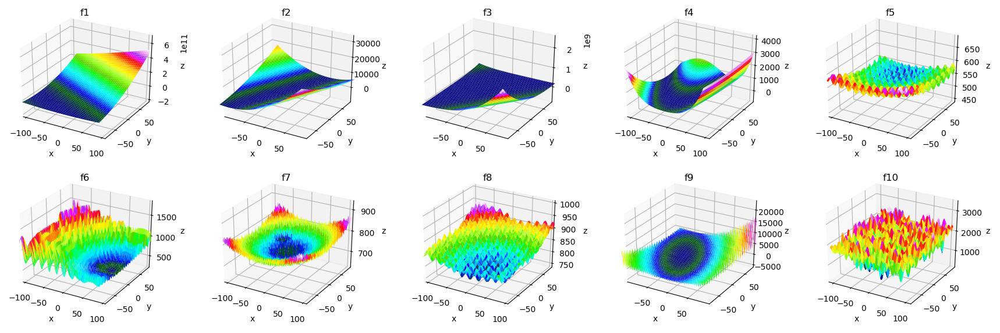

# CEC 2017 Python

> **⚠ 23 Nov 2022**: Breaking changes were made to all function signatures. See the changelog for details.

Python 3 module containing a native implementation of the CEC 2017 benchmark functions (single objective optimization). The implementation is adapted from Awad's original C implementation, available on [Suganthan's GitHub repo](https://github.com/P-N-Suganthan/CEC2017-BoundContrained), along with the problem definitions [1].

Although there are wrappers for the C code, this module is easier to use, natively supports numpy arrays and is (_much_) more readable than the C implementation.

During the implementation of this module, a few differences between the problem definitions and the original code were picked up on. In these cases, the implementation always follows whatever the original code did to remain compatible, and are marked with `Note:` comments.

As per the problem definitions, functions are defined for 10, 30, 50 and 100 dimensions, with functions `f1` to `f10` and `f21` to `f28` also being defined for 2 and 20 dimensions. If you provide custom rotation matrices (and shuffles, where applicable) you can however use arbitrary dimensions. Below are some surface plots for functions `f1` to `f10` over 2 dimensions.



> \[1\] _Awad, N. H., Ali, M. Z., Suganthan, P. N., Liang, J. J., & Qu, B. Y. (2016). Problem Definitions and Evaluation Criteria for the CEC 2017 Special Session and Competition on Single Objective Bound Constrained Real-Parameter Numerical Optimization._

## Features

- Native implementation of all CEC 2017 single objective functions optimized for multiple simultaneous evaluations
- Pre-defined rotations, shifts, and shuffles for 2, 10, 20, 30, 50 and 100 dimensions
- Allows custom rotations, shifts, and shuffles
- Convenient surface plot utility
- Easy access to basic functions f1 to f19 (e.g. Ackley, Discus, etc.)

## Installation

```
git clone https://github.com/tilleyd/cec2017-py
cd cec2017-py
python3 setup.py install
```

## Usage

Below is a simple example of executing either a single function or all functions. Note that each function takes a 2D array and returns a 1D array. See [example.py](example.py) for more advanced use cases.

```py
# Using only f5:
from cec2017.functions import f5
samples = 3
dimension = 50
x = np.random.uniform(-100, 100, size=(samples, dimension))
val = f5(x)
for i in range(samples):
    print(f"f5(x_{i}) = {val[i]:.6f}")

# Using all functions:
from cec2017.functions import all_functions
for f in all_functions:
    x = np.random.uniform(-100, 100, size=(samples, dimension))
    val = f(x)
    for i in range(samples):
        print(f"{f.__name__}(x_{i}) = {val[i]:.6f}")
```

## Changelog

### 23 Nov 2022
- All functions have been reimplemented using numpy vector operations instead of native python loops.
- **Breaking change:** Functions now expect a 2D input array of shape (m, D) where D is the dimensionality, and m is an arbitrary sample size.

The above updates have allowed a substantial increase in performance when evaluating multiple parameter samples simultaneously, which previously would have had to be done as consecutive calls. See [PR 5](https://github.com/tilleyd/cec2017-py/pull/5) for more details.

## License

Copyright &copy; 2022 Duncan Tilley
See the [license notice](LICENSE.txt) for full details.

## Issues

If you see any issues or possible improvements, please open an issue or feel free to make a pull request.
